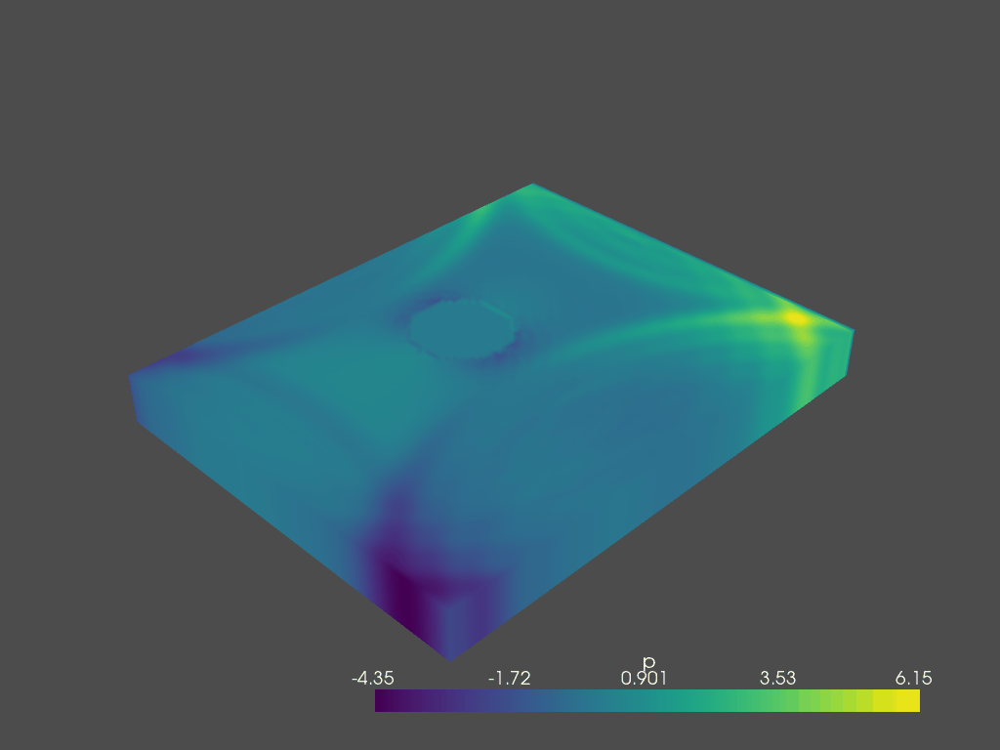

# CSCI596FinalProject
## Table of contents
* [General info](#general-info)
* [Technologies](#technologies-&-libraries)
* [Setup](#setup)
* [Reference](#reference)

## General info
This project is a CFD simulation and Visualization project. It used Lettuce to do the simulation and PyVista to do the visualization. The simulation part is based on Lettuce, which is a LBM based code with PyTorch implementation. PyVista is a module for the Visualization Toolkit (VTK), with a different approach on interfacing with VTK through NumPy and direct array access[^1].
In this project, it starts with a simple GUI, which can use the file link to input Obstacle information or manually input the information (2D) into the code. Then it will calculate the simulation and output with 100 VTK files to save the simulation data. Then, PyVista will process all the VTK files (ending in .vtr) and generate a gif file named output.gif.
	 
	 
## Technologies & Libraries
Project is created with:
* Anaconda
* PyTorch
* Lettuce: https://github.com/lettucecfd/lettuce
* PyVista: https://docs.pyvista.org/
* pyevtk
	
## Setup
To run this project, setting up the environment locally by following https://github.com/lettucecfd/lettuce

```
$ conda install pytorch torchvision torchaudio cudatoolkit=10.2 -c pytorch
$ conda install -c conda-forge pyevtk
```

## Reference
[^1]: https://docs.pyvista.org/
